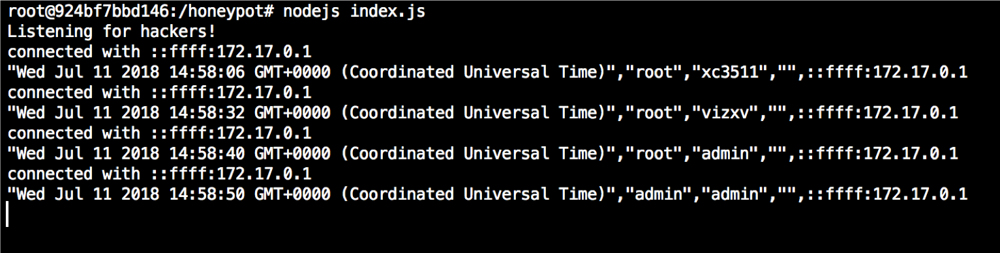

# mirai-honeypot
A fake IoT toaster that mimics a login procedure on port 23 with the hopes of recording hacking attempts. [credits to [arm5077](https://github.com/arm5077/mirai-honeypot)]

## Purpose

Visualize probes at port 23/tcp typical of Mirai's scan and loader.

## Usage

In the project folder:

`docker build -t mirai-honeypot .`

Run the container:

`docker run -p 2323:23 mirai-honeypot`

